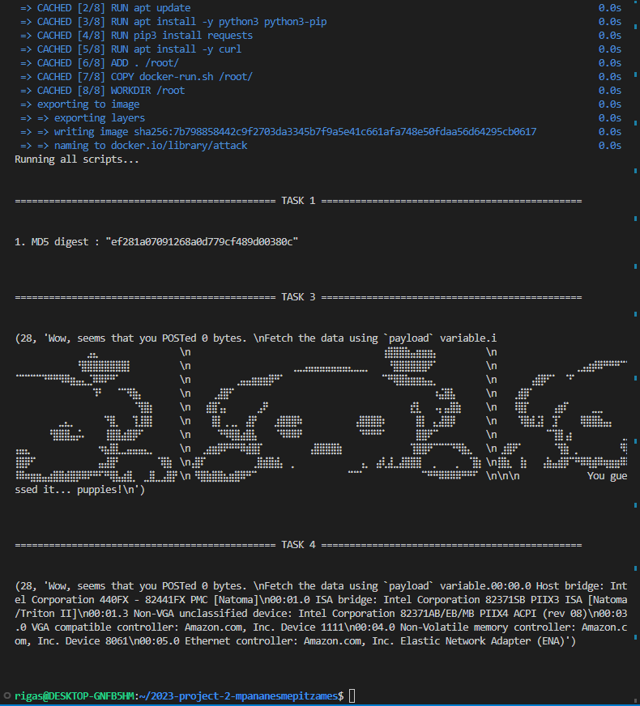
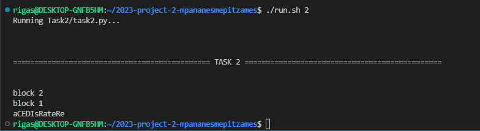

## 2023 Project 2

Βασιλείου Ρηγίνος sdi1900019
Γεωργία Σαράφογλου sdi1900168


Ο στόχος σας είναι να επιτεθείτε στον server `project-2.csec.chatzi.org`.
Γνωρίζετε ότι στο url http://project-2.csec.chatzi.org:8000
τρέχει o pico webserver, ο κώδικας του οποίου
υπάρχει στο [πακάτω repository](https://github.com/chatziko/pico).
Εχετε επίσης ήδη υποκλέψει:
- το username του site: `admin`
- το password: `8c6e2f34df08e2f879e61eeb9e8ba96f8d9e96d8033870f80127567d270d7d96`  
  (ο συγκεκριμένος webserver το δέχεται μόνο σε encrypted μορφή)

Tasks:

1. Βρείτε το MD5 digest του plaintext password
1. Βρείτε το plaintext password
1. Βρείτε το περιεχόμενο του αρχείου `/etc/secret` στον server
1. Βρείτε το αποτέλεσμα της εντολής `lspci` στον server


### Παρατηρήσεις

- Οι ίδιες ομάδες με την εργασία 1
- Εγγραφή στο github: https://classroom.github.com/a/HxmDkdtS

- Η ταχύτητα επίλυσης __δεν__ έχει βαθμολογική σημασία, αλλά θα υπάρχει "leaderboard"
  με τους 3 πρώτους που λύνουν κάθε task καθαρά για λόγους "flexing". Αν είστε στους
  πρώτους στείλτε claim στο `ys13@chatzi.org` (αλλιώς δεν χρειάζεται).

- Τα βήματα μπορούν να λυθούν με οποιαδήποτε σειρά, δεν χρειάζεται
  η λύση του ενός για το επόμενο (αλλά προτείνεται η σειρά που δίνεται).

- Hints:
  - Task 1: πρέπει να χρησιμοποιήσετε μια απλή ευπάθεια στον C κώδικα
  - Task 2: πρέπει να σπάσετε το encryption χρησιμοποιώντας μια ευπάθεια της υλοποίησης. __Δεν__
       πρέπει να κάνετε invert το digest από το task 1 (δεν θα το βρείτε
       σε MD5 databases, εκτός και αν κάποια άλλη ομάδα το βρει και το προσθέσει).
  - Tasks 3/4: buffer overflow attack. Το attack στο task 4 είναι λίγο πιο δύσκολο (αν θέλετε μπορείτε να κάνετε τα δύο tasks μαζί, αλλά στο 3 υπάρχει και λίγο πιο εύκολη λύση).

- Βαθμολογία μαθήματος
    - Εργασία 1: 4 μονάδες
    - Εργασία 2:
      - Task 1: 1 μονάδα
      - Task 2: 1 μονάδα
      - Task 3: 2 μονάδες
      - Task 4: 1 μονάδα
      - Docker: 1 μονάδα

- Στο τέλος του `README.md`: αναφέρετε τις απαντήσεις, και περιγράψτε τα βήματα που ακολουθήσατε. Μην ξεχάσετε να κάνετε commit μαζί με οποιοδήποτε κώδικα χρησιμοποιήσατε.
    Για ό,τι δεν ολοκληρώσετε περιγράψτε (και υλοποιήστε στο πρόγραμμα) την πρόοδό σας και πώς θα μπορούσατε να συνεχίσετε.

- Για όλα τα βήματα απαιτείται να γράψετε ένα πρόγραμμα που να αυτοματοποιεί την εύρεση της λύσης.
  Μπορείτε να χρησιμοποιήσετε ό,τι γλώσσα προγραμματισμού θέλετε, αλλά θα πρέπει να μπορώ να το τρέξω
  σε Ubuntu 22.04 χρησιμοποιώντας software που είναι διαθέσιμο στο Ubuntu. Θα πρέπει επίσης
  να φτιάξετε ένα script `run.sh` που εκτελεί το πρόγραμμα με ό,τι παραμέτρους χρειάζονται.

- Η πλήρης λύση της εργασίας απαιτεί να φτιάξετε ένα Docker container που να αυτοματοποιεί πλήρως την επίθεση. Ένα script ουσιαστικά, που απλά να εκτελείται σε container
ώστε να μπορεί να τρέξει οπουδήποτε. Πάραδειγμα `Dockerfile` υπάρχει στο repository,
και θα πρέπει να τρέχει με:
  ```
  docker build --tag attack . && docker run attack
  ```
  Λύσεις χωρίς docker γίνονται δεκτές, απλά χάνετε 1 μονάδα.

- Deadline: __20/7__ (μέχρι το τέλος της ημέρας)
  - Μπορείτε να παραδώσετε την εργασία και το Σεπτέμβρη, με μόνη διαφορά
  ότι το docker τότε θα πιάνει 3 μονάδες γιατί έχετε παραπάνω χρόνο
  (και πάλι όμως μπορείτε να πάρετε 10).

- __Οχι spoilers__

- __Οχι DoS__ ή brute force. Μπορείτε να χρησιμοποιείτε scripts που να κάνουν μια επίθεση με έναν λογικό αριθμό από requests (να μπορεί να τελειώσει σε μία ώρα max). Aλλά όποιος βαράει στα τυφλά μηδενίζεται
   (θέλουμε οι servers να είναι accessible από όλους). Αν δεν είστε σίγουροι αν κάτι επιτρέπεται, απλά ρωτήστε.

- Είναι σαφώς προτιμότερο να υλοποιήσετε πρώτα όλα τα attacks locally πριν τα τρέξετε στον server.

- Ο pico server έχει γίνει compile στο `linux03.di.uoa.gr`, οπότε μπορείτε εκεί να φτιάξετε
  ένα executable ακριβώς σαν αυτό που εκτελείται στον server.

- Αν θέλετε hints ρωτήστε privately (χωρίς βαθμολογική συνέπεια, σε λογικά πλαίσια).


### Report

### Task 1   

Βρήκαμε ευπάθεια στην printf στη γραμμή 126 του κώδικα της main printf(auth_username);. Αρχικά μας 
έβγαζε warning κατά το make οπότε το ψάξαμε. Βρήκαμε ότι έτσι μπορεί κάποιος ανάλογα με το input που
βάζει σε αυτή την μεταβλητή (το username ουσιαστικά), μπορεί να διαβάσει τα στοιχεία του stack. Έτσι 
με το input μας παίρνουμε κάποιες μεταβλητές από τη στοίβα σε δεκαεξαδική μορφή και τις μετατρέπουμε 
σε strings ώστε να μπορούμε να τις διαβάζουμε. Έτσι διαβάσαμε και το md5 digest του password και γράψαμε
ένα shell script που να στέλνει το curl command με τις κατάλληλες παραμέτρους.

### Task 2

Στο server αν γίνει κάποιο request με λάθος padding στο encryption του password θα εμφανιστεί error 500 ενώ στη περίπτωση σωστού padding θα έχει 401 ή 200 αν ο κωδικός είναι ο σωστός.

Εκμεταλλευόμενοι αυτής της πληροφορίας δημιουργήσαμε ένα oracle που σε κάθε request απαντάει true αν το padding είναι σωστό και false αν είναι λάθος.

Έπειτα κάνουμε decrypt κάθε block του cyphertext (από το τελευταίο προς το πρώτο) χρησιμοποιώντας το προηγόυμενο block. Για το πρώτο block του cyphertext χρησιμοποιούμε ως προηγούμενο μπλοκ το Initialize Vector που είναι 16 μηδενικά bytes.

Για το decrypt κάνουμε bruteforce requests μέχρι να βρόυμε valid padding που γνωρίζουμε ότι στο plaintext θα είναι 0x01, 0x02 0x02 κ.τ.λ. και ύστερα με πράξεις xor κάνουμε decrypt και τα υπόλοιπα βασιζόμενοι στον αλγόριθμο που βρίσκεται εδώ: https://flast101.github.io/padding-oracle-attack-explained/

Το αποτέλεσμα το μετατρέπουμε σε ascii και το εκτυπώνουμε.

### Task 3

Κοιτάζοντας τον κώδικα βρήκαμε τις εξής 2 γραμμές στη συνάρτηση post_param : 
```
char post_data[payload_size+1];     // dynamic size, to ensure it's big enough
strcpy(post_data, payload);
```
Αμέσως σκεφτήκαμε ότι θα μπορέσουμε να γεμίσουμε τον πίνακα post_data με σκοπό να γίνει κάποιο buffer overflow
και να αλλάξουμε τιμή στο return address της post_param. Ψάχνοντας παραπάνω στον κώδικα βρήκαμε την συνάρτηση 
send_file η οποία παίρνει σαν input το όνομα ενός αρχείου και γράφει στο stdout τα περιεχόμενά του. Καταλάβαμε 
λοιπόν πως αυτό που πρέπει να κάνουμε είναι να φτιάξουμε ένα payload με τέτοιον τρόπο ώστε να αλλάζει το 
return address της post_param με αυτό της send_file και να περνάει σαν όρισμα το "/etc/secret". 
Για να το πετύχουμε αυτό πρέπει πρώτα να καταλάβουμε πως δουλέυει η στοίβα του προγράμματος. Παίξαμε, έτσι, με 
το gdb. Τρέξαμε με gdb τοπικά τον pico server και θέσαμε breakpoints. Αναλυτικότερα : 

layout split  
set follow-fork-mode child  
b 127  

Το curl request που στείλαμε είναι το εξής :  
curl -s -I "http://127.0.0.1:8080/" --user "%08x.%08x.%08x.%08x.%08x%s%s:"  
```
(gdb) x/a $esp  
0xffffd4d0:     0xf7cefd20  
(gdb) x/a $ebp  
0xffffd538:     0xffffd568  

$ebp - $esp = ffffd538 – ffffd4d0 = 68  
$ebp - $esp = 4294956344 – 4294956240 = 104  
```
Άρα ο ebp έχει 104/4 = 26 words διαφορά από τον esp.Επίσης, γνωρίζουμε ότι 
το return address βρίσκεται ακριβώς μετά από τον $ebp, δηλαδή 27 words μετά τον $esp. Άρα το
return_address είναι το :
```
return_address = $esp+108

(gdb) x/a $esp+108  
0xffffd53c:     0x5655694a <route+104>
```
και για να επιβεβαιώσουμε τη θέση του ebp :
```
(gdb) x/a $esp+104  
0xffffd538:     0xffffd568  
```
Εκτυπώνοντας τον $esp και τα επόμενα 27 words :  
```
(gdb) x/28xw $esp  
0xffffd4d0:     0xf7cefd20      0x00000000      0x5655f356      0x5655c180  
0xffffd4e0:     0x00000000      0x5656f330      0x0000001d      0x00000000  
0xffffd4f0:     0x00000001      0x5656f330      0x5656f34c      0x5656f34d  
0xffffd500:     0x0000001c      0x00000000      0x00000000      0x00000000  
0xffffd510:     0xf7b7b90b      0xf7ced960      0xf7cefd20      0xf7b72520  
0xffffd520:     0xf7cefd20      0x00000000      0x00000000      0x04ee2700 (canary)  
0xffffd530:     0x5655f39f      0x5655befc      0xffffd568      0x5655694a (return_address)  
                                               (ebp_content)  

(gdb) x/a $ebp+4  
0xffffd53c:     0x5655694a <route+104>  
```
Θα δώσουμε τώρα για input στην printf 31 φορές το %08x (28 είναι τα words που έχουμε και τα 
άλλα 3 είναι για το call της printf).  
```
5656f330     0000009b   56556cdf    f7cefd20    00000000  
5655f3bf     5655c180   00000000    5656f330    0000009d  
00000000     00000001   5656f330    5656f3cb    5656f3cc  
0000009b     00000000   00000000    00000000    f7b7b90b  
f7ced960     f7cefd20   f7b72520    f7cefd20    00000000  
00000000     3f496d00   5655f3b0    5655befc    ffffd568    5655694a (return_address)  
             (canary)                         (ebp_content)  
```
Οι πληροφορίες που έχουμε μέχρι τώρα είναι : 
- Η 31η τιμή είναι το return address της συνάρτησης check_auth 5655694a.
- Η 30η τιμή είναι η τιμή του $ebp ffffd568
- Η 27η τιμή είναι η τιμή του canary 3f496d00.

Μας μένει να βρούμε :
- Το address της send_file και
- Το address του post_data

Για να τα βρούμε αυτά πρέπει να χρησιμοποιήσουμε κάποια από τις διευθύνσεις που βρήκαμε με το print format 
attack προηγουμένως. Η ιδέα είναι ότι χρησιμοποιώντας αυτές τις διευθύνσεις θα υπολογίσουμε τις τιμές των 
post_data και send_file με τα offset τους. Δηλαδή : 

Ξεκινάμε βρίσκοντας τη διεύθυνση του post_data και του send_file τοπικά :

b 184

curl -X POST -u test:029794db6e76cb559613732d7c94b24b360bb6f05879bb99e7765518b55abc57 -H "Content-Type: application/json" -d '{}' http://127.0.0.1:8080
```
(gdb) x/a post_data         [buffer]  
0xffffd4d0:     0xf7cefd20  
(gdb) info address send_file  
Symbol "send_file" is a function at address 0x56556f77.  
(gdb) x/a $ebp  
0xffffd538:     0xffffd568  
(gdb) x/a $esp  
0xffffd4d0:     0xf7cefd20  
```
Τώρα θα πάρουμε τα offsets του post_data (buffer) από το ebp_content και του send_file_address από το 
return_address :  
```
(gdb) x/a post_data  
0xffffd4f0:     0xf7cefd20  
(gdb) x/a $ebp  
0xffffd538:     0xffffd568  

post_data = 0xffffd4f0  
ebp_content = 0xffffd568  
post_data - ebp_content = ffffd4f0 – ffffd568 = -78  
[Decimal] post_data - ebp_content = 4294956272 – 4294956392 = -120  

send_file_address = 0x56556f77  
return_address = 0x5655694a  
send_file_address - return_address = 56556f77 – 5655694a = 62D  
[Decimal] send_file_address - return_address = 1448439671 – 1448438090 = 1581  
```
Άρα έχουμε offset buffer από ebp : -120 και  
offset send_file από return_address : 1581

Τώρα έχουμε όλες τις διευθύνσεις που θέλαμε προκειμένου να οργανώσουμε το attack. Το μόνο που μένει να κάνουμε 
είναι να περάσουμε στη send_file το "/etc/secret".

Τρέχοντας παρόμοια βήματα με παραπάνω αλλά με breakpoint 184 (πριν την strcpy και μετά τη δήλωση του post_data)
πήραμε τις διευθύνσεις των esp και ebp. Βρήκαμε έτσι ότι η διαφορά τους είναι 72/4 = 18 words και εκτυπώσαμε 
έτσι τον esp και τα 19 επόμενα words (19 γιατί ακριβώς πάνω από τον ebp βρίσκεται το return address). Από 
αυτά που βρήκαμε και όλα τα παραπάνω εξάγαμε τα εξής συμπεράσματα για το payload :

- "/etc/secret" 
- padding μέχρι να φτάσουμε 13 words 
- διεύθυνση buffer 
- 1 word 
- canary 
- 2 words 
- ebp 
- διεύθυνση send_file 
- 1 word 
- διεύθυνση buffer

Αποφασίσαμε να γεμίσουμε το padding με A και να βάλουμε το string "/etc/secret" στην αρχή. 

Τώρα πρέπει να φτιάξουμε το payload μας.
Ένα από τα πράγματα που παρατηρήσαμε είναι ότι το canary τελειώνει σε 00 
Γενικότερα θέλουμε να το αποφύγουμε αυτό λόγω της strcpy. Στον κώδικα της 
post_param στο main.c βλέπουμε ότι μετά την strcpy αντικαθιστά το '&' και το '='
με \0. Επομένως θα αντικαταστήσουμε τα 00 που υπάρχουν στις διευθύνσεις μας με τον
ascii κωδικό ενός εκ των δύο. Εμείς επιλέξαμε τον κωδικό του '&' = 26.

Περισσότερη ανάλυση για τη δημιουργία του payload βρίσκεται στον αντίστοιχο κώδικα (task3.py).
Τέλος τρέχοντας το attack είδαμε στο terminal μας τα puppies :dog:.

### Task 4

Καταλαβαίνουμε πως θα πρέπει να καλέσουμε τη συνάρτηση system() της C για να εκτελέσουμε την εντολή
lspci. Έχοντας ήδη κάνει το προηγούμενο attack η ιδέα είναι η ίδια. Θα κάνουμε ένα buffer overflow
με τα ίδια χαρακτηριστικά περίπου (για το payload), μόνο που αυτή τη φορά αντί για τη send_file, 
θα πρέπει να βρούμε το address της system και αντί για το string "/etc/secret" θα πρέπει να δώσουμε 
το "lspci".
Τώρα το να βρούμε τη διεύθυνση της system ήταν λίγο πιο δύσκολο από ότι αυτό της send_file. Βάλαμε τις 
εξής γραμμές στη main του server για να βρούμε τη διεύθυνση της system() :
```
int (*funptr)(const char*) = system;
fprintf(stderr, "\n\nsystem address : %p\n\n", funptr);
```
και παρατηρήσαμε ότι κάθε φορά που τρέχουμε τον server αλλάζει. Έτσι θα πρέπει να καταφέρουμε να βρούμε 
το address της system μέσω κάποιου offset το οποίο θα παραμένει σταθερό. Για αυτό χρησιμοποιήσαμε το 
Print format attack του προηγούμενου ερωτήματος και ψάχναμε για σταθερά offsets. Συγκεκριμένα :
1. Τρέχαμε τον server
2. Παίρναμε το address της system
3. Γράψαμε μια συνάρτηση η οποία για κάθε ένα address που εμφανίζεται από τις 31 τιμές της στοίβας βρίσκει
το offset του με το address της system και τα γράφει σε ένα αρχείο.
Επαναλάβαμε αυτή τη διαδικάσια 5 φορές (δηλ. για 5 διαφορετικές τιμές του address της system) και στο τέλος 
ψάξαμε για κάποιο offset που να μένει σταθερό.
Κοιτάζοντας το αρχείο μας παρατηρήσαμε ότι η διεύθυνση που βρίσκεται στην θέση 23 (το 24ο στοιχείο δηλαδή) της
λίστας addresses έχει σταθερό offset από τη system κάθε φορά (-1746336). Επομένως αποφασίσαμε να χρησιμοποιήσουμε
αυτό το στοιχείο για να μπορούμε να βρίσκουμε την διεύθυνση της system. 
```
system_addr = addresses[23] - 1746336
```
Σε αυτό το attack βάλαμε την παράμετρο που θα πάρει η system στο τέλος του payload. Γενικά τα offsets μας είναι 
γνωστά από το προηγούμενο ερώτημα. Επομένως το payload που χτίσαμε τώρα είναι : 
- 13 words
- buffer_address
- 1 word
- canary
- 2 words
- ebp
- system_address
- 1 word
- Το address της παραμέτρου που θα περάσουμε στην system 
- "lspci" (το string που θα περάσουμε στην system)

Κάθε κώδικα τον τρέξαμε πρώτα τοπικά και μετά στον server. Στο αρχείο offsets.txt υπάρχουν τα offsets που εξετάσαμε 
στο task 4. 
Για το run.sh :
- Αρχικά chmod +x run.sh
- Εντολή για να τρέξουν όλα τα scripts : ./run.sh
- Εντολή για ένα συγκεκριμένο : ./run.sh <αριθμός του task> π.χ. για το task 1 ./run.sh 1 


### Docker

Τρέχουμε με sudo docker build --tag attack . && sudo docker run attack. Και έχουμε :



Επειδή για κάποιο λόγο το task2 δε δουλεύει από το docker βάλαμε μόνο τα 1,3,4 στο docker. Αν θέλετε να τρέξετε το attack 
του 2 για να δείτε ότι δουλεύει τρέξτε το με ./run.sh 2. Δοκιμάσαμε πολλές αλλαγές στον κώδικα και στον τρόπο που κάνουμε
τα request για να δούμε τι φταίει αλλά δεν τα καταφέραμε. Το αποτέλεσμα που παίρνουμε είναι :



Τα 3,4 μπορεί να μην τρέξουν λόγω πολλών request στον server. Απλά ξανατρέξτε τα. 